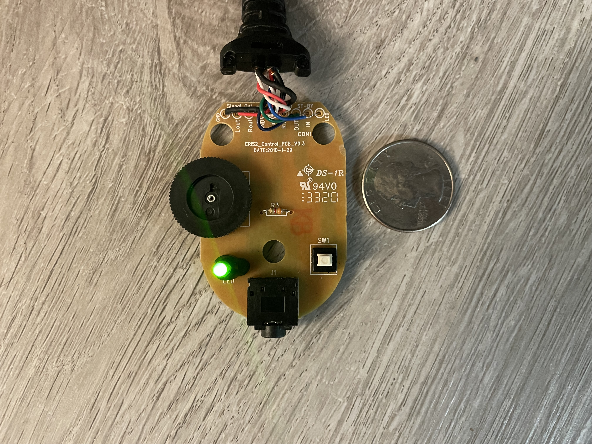
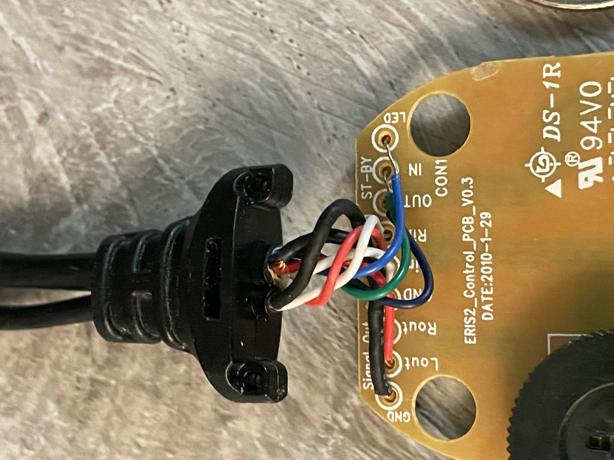

# Project Overview
## Problem Formulation
  This project is an extension of a pre-existing product, that being a Logitech Z313 Speaker System with Subwoofer [1]. This speaker system is wired as the output to a sony TV, one that can be controlled with a wireless controller, but does not respond to volume up or volume down. This is okay, because the Logitech speakers do not work with the TV volume. The Logitech speakers control their volume by manuelly controlling a potentiometer. I would like the ability to control the volume remotely. The TV remote not controlling the TV volume works with us in this case, we can read the IR signals coming from the remote with an IR sensor, and audjust the potentiometers to control the volume.
  
  The pre-existing circuit can be seen in Circuit_Board_Scale, and the wires we will be working with can be seen in Circuit_Board_Connectors.
  

The pins go as follows: GND, Lout, Rout, GND, Lin, Rin, OUT, IN, LED. Looking at the back reveals that both grounds are connected to eachother, creating a common ground.
- Lout and Rout are the left and right channels post-potentiometer
- Lin and Rin are the left and right channels pre-potentiometer
- OUT and IN seem to be used as a way to tell if the system is on or off.  They are connected through the dbdt switch and nothing else.
- LED is the power that goes to the LED, we might be able to tap into this power for the integrated circuits. UNKNOWN VOLTAGE

## Proposed Solution
  In order to read IR signals, we need to include a microcontroller, but in order to choose one, we need to know what else is needed.  2 physical buttons will take the place of the current physical potentiometer, which changes the internal volume variable. And rgb LED to determine when the system is powered, this can also be used as a debugging tool, changing colors when changeing internal variables. 2 digital potentiometers used to audjust the left and right channel, controlled through I2C. A dbdt switch will be used to control the "power" led signifier, connect the stand-by OUT and IN, and introduce power to the rest of the system. The microcontroller in question will need 2 pins for I2C communication (and the ability to do that), 2 pins for manuel control (2 buttons), 2 pins for the LED (Blue and Green), and 1 pin for the IR Sensor. In total we need 7 useable pins, and the ATtiny 404 will fit our case [2]. We will include 2 digital potentiometers that are controlled with I2C 
  
  The ATtiny comes with support for I2C in the form of an SDA pin and a SCL pin (PB1 and PB0). The LED pins will be PA6 and PA7 (___ and ___ respectively), the 2 buttons will be PA4 and PA5 (up and down respectively), and the IR LED pin will be PB2. This leads us to the final list of pins:
- PA0: large pin surface for programming
- PA4: Volume up pushbutton (5V)
- PA5: Volume down pushbutton (5V)
- PA6: LED ____
- PA7: LED ____
- PB0: SCL
- PB1: SDA
- PB2: IR LED
  
## References
[1] https://www.logitech.com/en-us/shop/p/z313-speaker-system-subwoofer.980-000382 
[2] https://www.digikey.com/en/products/detail/microchip-technology/ATTINY404-SSNR/8594960
